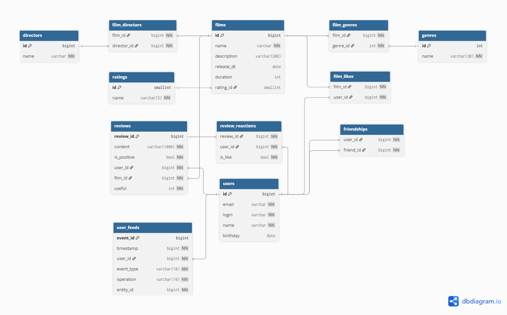

# java-filmorate
Учебный проект Filmorate.

## Структура БД


**films** - таблица с данными по фильмам
* id - идентификатор фильма (первичный ключ)
* name - название фильма
* description - описание фильма
* release_dt - дата выпуска фильма
* duration - продолжительность фильма
* raiting_id - идентификатор  МРА-рейтинга фильма (внешний ключ к таблице raitings)

**ratings** - таблица с данными по рейтингам Ассоциации кинокомпаний
* id - идентификатор рейтинга (первичный ключ)
* name - название рейтинга ("PG", "PG-13" и т.п.)

**genres** - таблица с жанрами фильмов
* id - идентификатор жанра (первичный ключ)
* name - название жанра

**film_genres** - таблица с привязками жанров к фильмов (у одного фильма может быть несколько жанров)
* film_id - идентификатор фильма из таблицы films
* genre_id - идентификатор жанра из таблицы (genres)

**users** - таблица с данными по пользователям filmorate
* id - идентификатор пользователя (первичный ключ)
* email - электронная почта пользователя
* login - логин пользователя
* name - имя пользователя
* birthday - дата рождения пользователя

**film_likes** - таблица с данными по лайкам, поставленным пользователями фильмам
* film_id - идентификатор фильма
* user_id - идентификатор пользователя, поставившего лайк фильму

**friendship** - таблица с данными о том, кто с кем дружит в filmorate.
* user_id - идентификатор пользователя, отправившего запрос на добавление в друзья
* friend_id - идентификатор пользователя, которому был направлен запрос
* is_approved - флаг того, подтверждена ли дружба: True - если второй пользователь подтвердил дружбу, False - если не подтвердил.

### Примеры запросов
1) Жанры, к которым относится фильм с id = 1:
```(sql)
SELECT g.name AS genre
FROM film_genres AS fg 
JOIN genres AS g ON g.id = fg.genre_id
WHERE fg.film_id = 1;
```

2) Подсчёт количества лайков у фильма с id = 1:
```(sql)
SELECT COUNT(1) as likes_cnt
FROM film_likes
WHERE film_id = 1;
```

3) Топ-10 самых залайканых фильмов
```(sql)
WITH top AS (
    SELECT film_id, COUNT(1) AS likes_cnt
    FROM film_likes
    GROUP BY film_id
    ORDER BY likes_cnt DESC
    LIMIT 10
)

SELECT films.id,
       films.name,
       top.likes_cnt
FROM top
JOIN films ON top.film_id = films.id
ORDER BY likes_cnt DESC;
```

4) Список подтверждённых друзей пользователя с id = 1   
```(sql)
    SELECT friend_id
    FROM friendships
    WHERE user_id = 1 AND is_approved

    UNION

    SELECT user_id AS friend_id
    FROM friendships
    WHERE friend_id = 1 AND is_approved
```